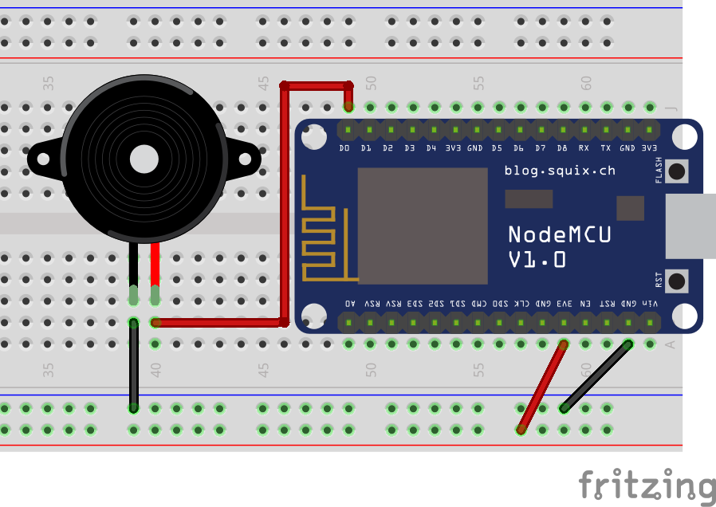

# Buzzer



Coming soon...

<!-- 

O seguinte código faz com que o Buzzer emita som por meio segundo e fique em silêncio por meio segundo, e esse loop é repetido indefinidamente. Que tal experimentar deixar o buzzer emitindo som por diferentes períodos de tempo? Ou então, caso queira se aprofundar um pouco, [pesquise sobre como reproduzir notas musicais](https://www.arduino.cc/en/Tutorial/toneMelody). Note que este é praticamente o mesmo código utilizado para o LED, mas o circuito do Buzzer não precisa de resistor.

```arduino
const int buzzer_pin = D0;

void setup()
{
  pinMode(buzzer, OUTPUT);
}

void loop()
{
  digitalWrite(buzzer, HIGH);
  delay(500);
  digitalWrite(buzzer, LOW);
  delay(500);
}
``` -->