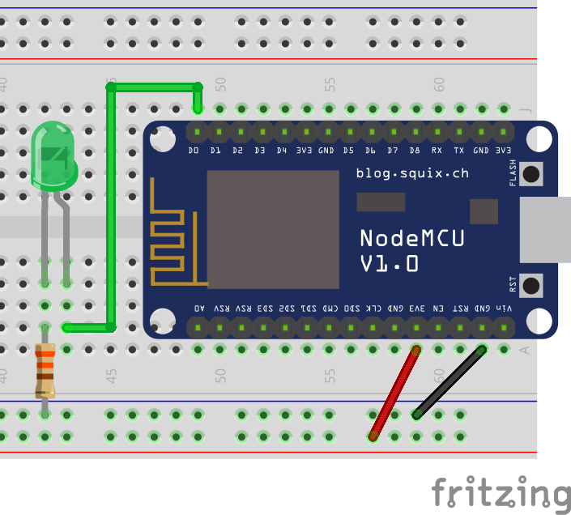

# LED

A LED (Light-Emitting Diode) is one of the most common elements in electronics. It is a cheap and low energy consumption light source 💡. You can use LEDs as indicators of the system status, feedback for human actions, or any other kind of visual communication you can devise by turning LEDs on, off and controlling their brightness. Keep in mind, however, that conventional LEDs cannot change color, for that you need to use an RGB LED.



!>**⚡ Resistor:** for the safety of your components, don't forget to use a 330Ω resistor as illustrated.

?>**🤔 Correct side?** LEDs are polarized, which means one of their connectors is the positive side, and the other is negative. In the above image, the positive side is the one with the bent pin. To identify polarity, take notice that the longest pin is usually the positive one, and the negative side has a flat edge on the LED's outer casing.

The following code is the electronics equivalent of the Hello World. It turns the LED for one second (1000 milliseconds), turns it off for another second, and then this loop is repeated indefinitely. The code itself is straightforward and does not need any library for it to work.

```arduino
const int led_pin = D0;

void setup()
{
    pinMode(led_pin, OUTPUT);
}

void loop()
{
    digitalWrite(led_pin, HIGH);
    delay(1000);
    digitalWrite(led_pin, LOW);
    delay(1000);
}
```

## A More Useful Code Example

The above code example uses the `delay()` function to control time. However, it comes at the price of pausing the whole program for two seconds every loop ⏳, which is far from ideal. Because sometimes you need to do two things at once (like to blink your LED while also reading a button press), the following code makes use of some time-related variables and conditions to avoid using the delay function. 

```arduino
const int led_pin =  D0;
boolean led_power = false;
unsigned long previous_millis = 0;
const long blink_interval = 1000;

void setup()
{
    pinMode(led_pin, OUTPUT);
}

void loop()
{
    unsigned long current_millis = millis();
    if (current_millis - previous_millis > blink_interval)
    {
        previous_millis = current_millis;
        led_power = !led_power;
        digitalWrite(led_pin, led_power);
    }
}
```

## Brightness Control

Besides turning LEDs on and off, you can also control their brightness. To do so, you need to use the `analogWrite()` function instead of `digitalWrite()`. The first parameter is the same in both functions, the desired pin. The second parameter, however,  is not binary anymore, but a number ranging from 0 (LED off) to 1023 (maximum brightness). The following code illustrates the use of this function to make a LED quickly pulsate.

```arduino
int led_pin = D0;
int led_brightness = 0;
int led_brightness_step = 5;

void setup()
{
  pinMode(led_pin, OUTPUT);
}

void loop()
{
    analogWrite(led_pin, led_brightness);
    if (led_brightness < 0 || led_brightness > 1023)
    {
        led_brightness_step = -led_brightness_step;
    }
    led_brightness = led_brightness + led_brightness_step;
    delay(1);
}
```