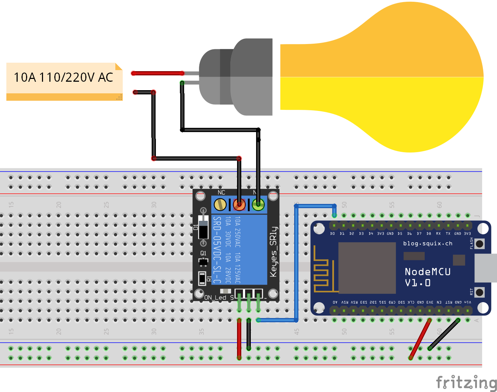

# Relay

Microcontrollers operate with relatively low voltages (usually between 3.3V and 5V), which makes it impossible for them to power and directly control higher voltage ⚡ (110V or 220V, for instance) devices. If you want to turn on a light bulb 💡 or any other home appliance with a microcontroller, you will need a relay module.



!>**☠️ Danger!** Because you may have to work with stripped wires and power outlets, it is paramount to be careful and know exactly what you are doing when working with higher voltages, such as 110V or 220V.

The following code is basically the same used to indefinitely turn an LED on and off in one second (1000 milliseconds) intervals, but instead, it activates the relay module. The code itself is straightforward and does not need any library for it to work.

```arduino
const int relay_pin = D0;

void setup()
{
    pinMode(relay_pin, OUTPUT);
}

void loop()
{
    digitalWrite(relay_pin, HIGH);
    delay(1000);
    digitalWrite(relay_pin, LOW);
    delay(1000);
}
```

## A More Useful Code Example

The above code example uses the `delay()` function to control time. However, it comes at the price of pausing the whole program for two seconds every loop ⏳, which is far from ideal. Because sometimes you need to do two things at once (like activate a relay while also reading a button press), the following code makes use of some time-related variables and conditions to avoid using the delay function. 

```arduino
const int relay_pin =  D0;
boolean relay_power = false;
unsigned long previous_millis = 0;
const long blink_interval = 1000;

void setup()
{
    pinMode(relay_pin, OUTPUT);
}

void loop()
{
    unsigned long current_millis = millis();
    if (current_millis - previous_millis > blink_interval)
    {
        previous_millis = current_millis;
        relay_power = !relay_power;
        digitalWrite(relay_pin, relay_power);
    }
}
```