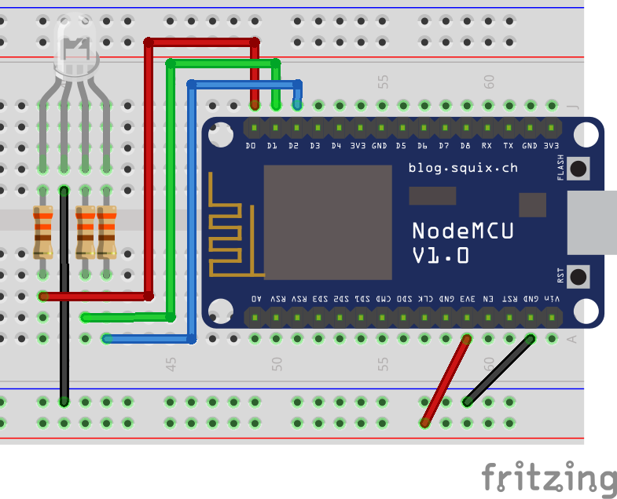

# RGB LED

A LED (Light-Emitting Diode) is one of the most common elements in electronics. It is a cheap and low energy consumption light source 💡. You can use LEDs as indicators of the system status, feedback for human actions, or any other kind of visual communication you can devise by turning LEDs on, off and controlling their brightness. But this is no ordinary LED, this is an RGB LED 🌈! With dedicated pins for red, green and blue, you can also change its color.



!>**⚡ Resistor:** for the safety of your components, don't forget to use 330Ω resistors as illustrated.

?> **🚥 Common Cathode vs. Common Anode:** there are two kinds of RGB LEDs. The above example uses a common cathode one, so the energy pin is connected to `GND`. A common anode, on the other hand, should have the energy pin on `3V3`. It's easy to confuse between the two, so if your RGB LED seems broken maybe it's the other kind!

The following code changes the color of the RGB LED each second following this sequence: red, green, blue, cyan, magenta and yellow. The color is changed by calling the `setColor()` function declared at the bottom, which converts conventional RGB values (0-255 for each color) to a scale ranging from 0 to 1023 to be used with the `analogWrite()` function.  The code itself is straightforward and does not need any library for it to work. 

```arduino
const int red_pin = D0;
const int green_pin = D1;
const int blue_pin = D2;

void setup()
{
    pinMode(red_pin, OUTPUT);
    pinMode(green_pin, OUTPUT);
    pinMode(blue_pin, OUTPUT);
}

void loop()
{
    setColor(255, 0, 0);
    delay(1000);
    setColor(0, 255, 0);
    delay(1000);
    setColor(0, 0, 255);
    delay(1000);
    setColor(0, 255, 255);
    delay(1000);
    setColor(255, 0, 255);
    delay(1000);
    setColor(255, 255, 0);
    delay(1000);
}

void setColor(int r, int g, int b)
{
    r = map(r, 0, 255, 0, 1023);
    g = map(g, 0, 255, 0, 1023);
    b = map(b, 0, 255, 0, 1023);
    analogWrite(red_pin, r);
    analogWrite(green_pin, g);
    analogWrite(blue_pin, b);
}
```

## Fading Colors

If you call the `setColor()` function with continuous and timed small increments, you can achieve the effect of fading colors. The code below, for instance, cycles through the RGB spectrum in such manner.

```arduino
const int red_pin = D0;
const int green_pin = D1;
const int blue_pin = D2;

void setup()
{
    pinMode(red_pin, OUTPUT);
    pinMode(green_pin, OUTPUT);
    pinMode(blue_pin, OUTPUT);
}

void loop() {
    unsigned int rgb[3];

    rgb[0] = 255;
    rgb[1] = 0;
    rgb[2] = 0;  

    for (int i = 0; i < 3; i++)
    {
        int k = (i + 1) % 3;

        for(int j = 0; j < 255; j++)
        {
            rgb[i]--;
            rgb[k]++;
            setColor(rgb[0], rgb[1], rgb[2]);
            delay(5);
        }
    }
}

void setColor(int r, int g, int b)
{
    r = map(r, 0, 255, 0, 1023);
    g = map(g, 0, 255, 0, 1023);
    b = map(b, 0, 255, 0, 1023);
    analogWrite(red_pin, r);
    analogWrite(green_pin, g);
    analogWrite(blue_pin, b);
}
```