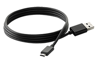
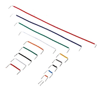

# Essentials

## Organizer Box

Pincello has a lot of small components, and your life will be much easier if you can keep them safely stored when not used, but also well organized so you can quickly find what you need.

## Micro USB Cable

You will need this cable to both program and provide power to the microcontroller by connecting it to your computer. If the microcontrller is already programmed and you only need to provide power, then you can connect it to a portable charger.

## ESP8266 NodeMCU 1.0 Microcontroller

This microcontroller can be considered the central part of the kit. It has multiple General-Purpose Input/Output (GPIO) pins to connect different kinds of sensors and actuators, it can be programmed with the uncomplicated Arduino Language (C/C++), and it has Wi-Fi, which means it can connect to the Internet.

## 830 Points Breadboard

Electronics can be quite difficult (and expensive) if you have to solder connections everytime you want to test an idea. A breadboard is designed to prototype circuits without the need of soldering, and this one will acommodate not only your circuits, but also the ESP8266 NodeMCU 1.0 Microcontroller. For more information about breadboards, this tutorial can be useful: [How to Use a Breadboard](https://learn.sparkfun.com/tutorials/how-to-use-a-breadboard).

## Rigid Jumper

To connect circuits on a breadboard you need jumpers (which are basically wires). You can use any kind of available jumper to make your circuits. However, a rigid jumper is a bit more practical for prototyping because it already comes in convenient sizes and can be easily and sturdly placed on a breadboard.

## 330Ω Resistor

Resistors are needed in circuits for many reasons. For instance, their correct use prevents damage to sensible components such as the microcontroller. In Pincello, this particular 330Ω resistor will be used in LEDs (both single color and RGB). For more information on resistors, this tutorial is recommended: [Resistors](https://learn.sparkfun.com/tutorials/resistors).

## 10kΩ Resistor

Another use for resistors is to control how energy flows in your circuit (always throught the path with less resistance). In Pincello, this particular 10kΩ resistor will be used with push buttons to control high and low states. Again, for more information on resistors, this tutorial is recommended: [Resistors](https://learn.sparkfun.com/tutorials/resistors).