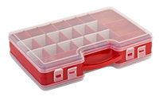

# Essentials

## Organizer Box

Pincello has a lot of small components, and your life will be much easier if you can keep them safely stored when not used, but also well organized so you can quickly find what you need.

## Micro USB Cable

Comming soon...

## ESP8266 NodeMCU 1.0 Microcontroller

Comming soon...

<!-- Arduino compatible controller (what does this mean?). Alternatives: WEMOS D1 Mini and the newer WEMOS LOLIN32. -->

## 830 Points Breadboard

Comming soon...

## Rigid Jumper

Comming soon...

## 330Ω Resistor

Comming soon...

## 10kΩ Resistor

Comming soon...