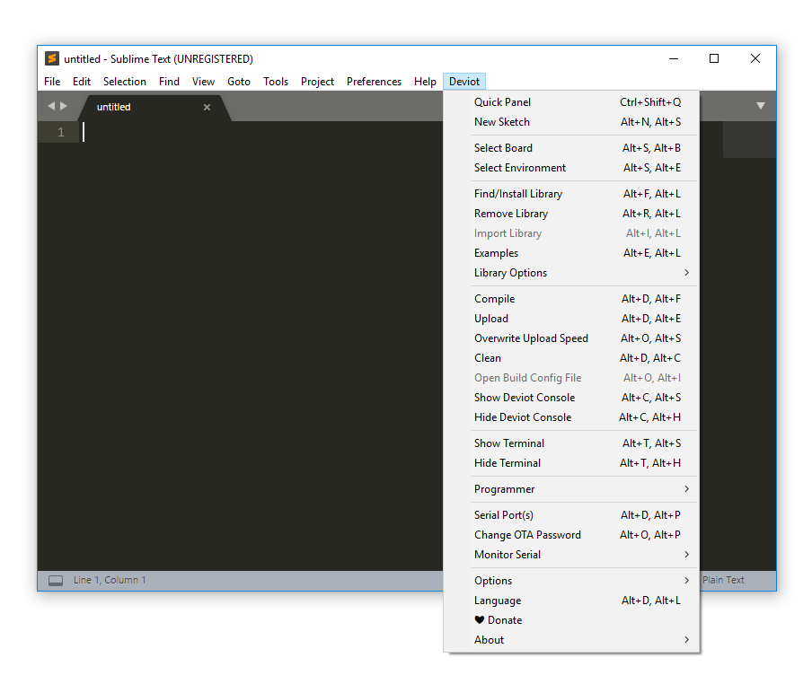
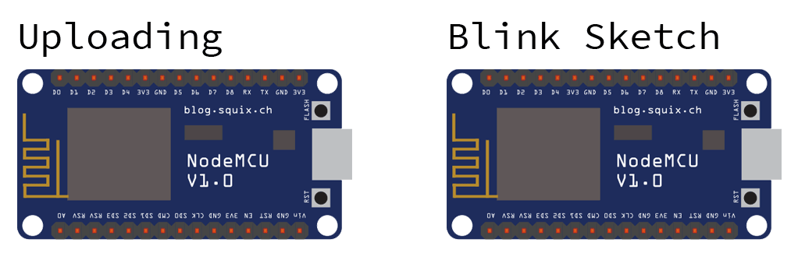
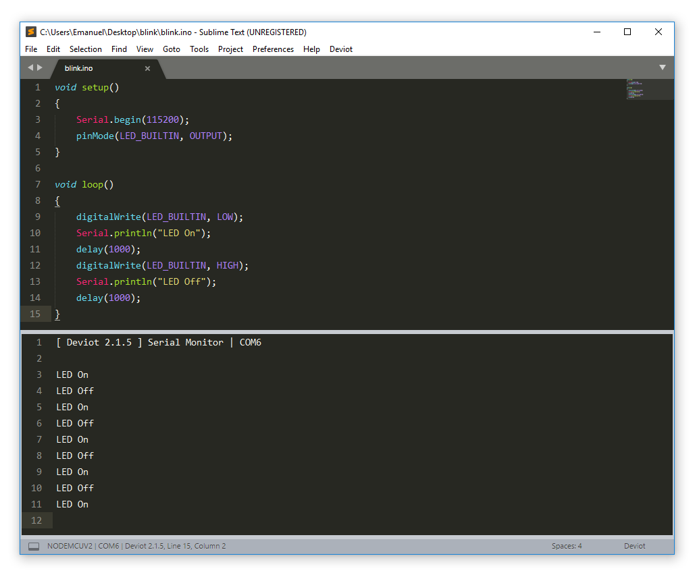

# How to Program the Microcontroller

There are many ways to program a microcontroller. The ESP8266 NodeMCU 1.0, for instance, can be programmed in Lua Script or MicroPython if you flash a specific firmware. It can also be programmed with the Arduino Language (essentially C/C++). Each of these options choices has pros 👍 and cons 👎, but considering the maturity of development tools, availability of tutorials, libraries, and documentation, the Arduino Language will be used.

In turn, there are many tools to program a microcontroller with the Arduino Language. Perhaps the most common way is to use the [Arduino IDE](https://www.arduino.cc/en/Main/Software), which doesn't have native support for the ESP8266 microcontroller, but it can be [installed using the boards manager](http://www.whatimade.today/esp8266-easiest-way-to-program-so-far/). However, Arduino IDE's code editing capabilities are insufficient when compared to current text editors, and it also lacks adequate support for promising IoT boards not designed or manufactured by Arduino, such as the ESP32, the successor of the ESP8266.

There are some proper alternatives for the Arduino IDE. Among them, the acclaimed [Sublime Text](https://www.sublimetext.com/) editor, together with the [Deviot](https://github.com/gepd/Deviot) package. This combination was chosen for providing a robust text editor and, because Deviot uses [PlatformIO](http://platformio.org/) under the hood, native support for a broad range of Arduino and non-Arduino hardware. If, however, you are still not satisfied with this choice, another option would be to use [PlatformIO IDE](http://platformio.org/platformio-ide), which is officially available as an [Atom](https://atom.io/) package or a [VSCode](https://code.visualstudio.com/) extension, but can also be used alongside [other editors](http://docs.platformio.org/en/latest/ide.html). Just keep in mind that this guide is written with Sublime Text and Deviot in mind, some steps may vary in different setups.

?>**💸 Is Sublime Text free?** Although Sublime Text is not free, it may be downloaded and evaluated for free, and there is no enforced time limit for the evaluation.  Deviot is free and open-source.

## 1. Install Sublime Text

Sublime Text is available for Windows, Linux and OS X. Head to [https://www.sublimetext.com/](https://www.sublimetext.com/) and download the editor (the current version at the writing of this guide is 3.0, build 3143). The installation process is pretty straightforward. However, many would argue that Sublime Text isn't complete without [Package Control](https://packagecontrol.io/). Package Control is a package manager which makes it very simple to search, install and update packages for the editor. To install it, follow the instructions on [https://packagecontrol.io/installation](https://packagecontrol.io/installation).

?> **🎨 Command Palette:** this is one of the best features of the Sublime Text editor in terms of productivity. You can open it from `Tools > Command Palette...` or with <kbd>Ctrl</kbd> + <kbd>Shift</kbd> + <kbd>P</kbd>. Once the Command Palette is open, you can freely type what you want, such as toolbar actions or other useful commands.

## 2. Install Deviot for Sublime Text

Before anything else, Deviot needs [Python](https://www.python.org/) to work, more specifically, Python 2.x. If you use Linux or OS X, you probably already have it pre-installed, if not, you can easily install it from [https://www.python.org/downloads/](https://www.python.org/downloads/) (the current version at the writing of this guide is 2.7.14).

!> **🐍 Attention:** make sure to install **Python 2.x**, not Python 3.x! Windows users also need to make sure to select the option to add Python to PATH during the installation process.

After making sure you have Python 2.x installed, you are now ready to install Deviot. In Sublime Text, bring up the Command Palette (`Tools > Command Palette...` or <kbd>Ctrl</kbd> + <kbd>Shift</kbd> + <kbd>P</kbd>) and then search for and select the option `Package Control: Install Package`. You will be prompted with a search field for the package you want to install, search for `Deviot (Arduino IDE)`, hit enter and wait until it's installed.

?> **🔍 Command Palette search:** you don't need to type everything in sequence: by typing `install` (or even less), it will already bring up and focus `Package Control: Install Package`, then you just have to hit enter.

After Deviot is installed, a new menu option should appear inside Sublime Text:



You can access everything related to Deviot from this menu or the Command Palette.

## 3. Create Your First Sketch

Now that the proper tools are ready, it's time to create your first sketch (in Arduino terminology, a sketch is a program). In Sublime Text, go to `Deviot > New Sketch` (or use the Command Palette if you're already comfortable with it) and type in `blink` as the name of the sketch (or, if you are rebellious 😠, any other name you want 😁) and hit enter. After you named the sketch, you still need to select the directory where it will be saved (your choice will be remembered as the first option next time).

?> **📁 Arduino Sketch structure:** every Arduino sketch has the same structure, which is composed of a folder with the name of the sketch, and inside the folder a `.ino` file with the same name as the folder. In the example above, it will create `blink/blink.ino` in the directory you selected. If you want to, you can manually create a sketch folder and file and open it with Sublime Text.

Go ahead and fill in the new file with the following electronics equivalent of the Hello World:

```arduino
void setup()
{
    Serial.begin(115200);
    pinMode(LED_BUILTIN, OUTPUT);
}

void loop()
{
    digitalWrite(LED_BUILTIN, LOW);
    Serial.println("LED On");
    delay(1000);
    digitalWrite(LED_BUILTIN, HIGH);
    Serial.println("LED Off");
    delay(1000);
}
```

But what is this code 🤔? Usually, every Arduino file needs two necessary methods: `setup` and `loop`. When the microcontroller runs the sketch, whatever code is inside the `setup` method will be executed first, but only once, and whatever code is inside the `loop` method will repeatedly be executed after the `setup`. In the example above:

- In `setup`, you:
    - begin the serial communication with a baud rate of 115200; and
    - configure the pin of the built-in LED as output.
- In `loop`, you:
    - turn on our built-in LED;
    - print the information that our LED is on;
    - wait a second (1000 milliseconds);
    - turn off our built-in LED;
    - print the information that our LED is off; and
    - wait a second before starting the loop all over again.

?> **📺 Serial communication?** While the serial communication is not needed for our sketch to work, it can be a useful debugging tool when used with a serial monitor, as you will do in the next step.

## 4. Compile & Upload Your Sketch

But enough about theory! This is the moment of truth 🤞. First, you need to connect the microcontroller to the computer by using a micro USB cable. Then go to `Deviot > Select Board` and search for `NodeMCU 1.0 (ESP12E Module)`. Now Deviot knows how to compile your code properly.

?> **💿 Drivers:** most computers will automatically recognize the microcontrollers when connected. If not, for the ESP8266 NodeMCU 1.0 microcontroller you may need to install the CH340/CH341 drivers from the manufacturer's website: [Windows](http://www.wch.cn/download/CH341SER_EXE.html), [Linux](http://www.wch.cn/download/CH341SER_LINUX_ZIP.html) or [OS X](http://www.wch.cn/download/CH341SER_MAC_ZIP.html) (unfortunately, you will need to exercise your Chinese, or use Google Translator).

Then, to compile and upload the sketch go to `Deviot > Upload` (or use the Command Palette 😉). Don't worry about the `Deviot > Compile` option, when you select upload it will already automatically compile the sketch). After you hit the upload option, Deviot may ask you to select a USB port from the list if it does not automatically know which one to use. The exact port name will vary from computer to computer, but it will be something like `USB-SERIAL CH340 (COM6)` on Windows, `/dev/cu.wchusbserial30` on OS X, and `/dev/ttyUSB0` on Linux (`USB`, `Serial` and `tty` are the keywords you are looking for). Finally, it will compile the code and upload it to the microcontroller.

?> **⏳ Compilation and upload time:** the first sketch you try to compile and upload in Deviot will begin some under the hood configurations. Because of this, the process may take a few minutes 🕑 for the first time, be patient. However, you can save some time in subsequent uploads by increasing the upload speed on `Deviot > Overwrite Upload Speed` (the default value usually is 9600, but you can safely raise it to 115200).

If everything went well, a LED in the microcontroller should light up for a second and stay out for another second, and then light up again in an infinite loop. (Keep in mind that while the code is uploaded, a small LED will rapidly blink on the microcontroller, it's not the sketch yet, but just an indicator that the microcontroller's memory is being written.)



You may also go top `Deviot > Monitor Serial > Start/Stop Monitor`, this should bring up the serial monitor where you can see our printed messages indicating the LED went on or off.



?> **🔣 Baud rate:** if you open the serial monitor and can only see strange unintelligible symbols, don't worry, nothing's broken. You just need to set the baud rate to the same value as declared in the code. To set it to 115200, as in the above example, go to `Deviot > Monitor Serial > Baudrate > 115200`.

Congratulations on your first sketch 👏! Now that you have an MQTT Broker set-up and can program a microcontroller, it's time to do a [basic communication tutorial](fs-basic-communication-tutorial.md), it will be fun, promise!