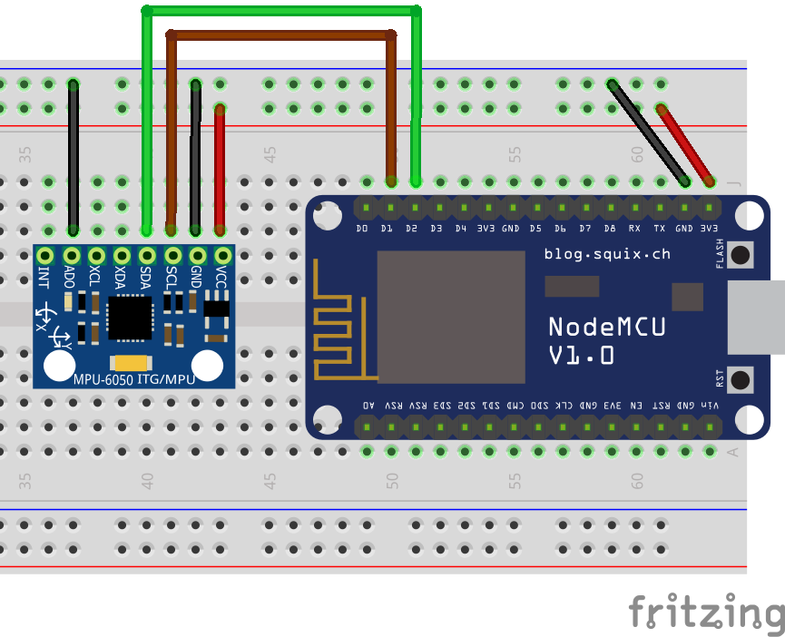

# Accelerometer & Gyroscope Sensor (MPU-6050)

The MPU-6050 sensor contains both an accelerometer and a gyroscope in the same component. It is a very accurate sensor that captures in real time acceleration 🚀 and rotation 💫 in the `x`, `y` and `z` axis. Reading raw values is relatively easy, but figuring out what to do with them can be more challenging.



?> **📚 Library:** for the following code to work you will need to install the [Sensors library by James Smith](https://github.com/loopj/i2c-sensor-hal). To install it, go to `Deviot > Find/Install Library` and search for `Sensors`, it should be the first result.

The following code initializes a connection with the sensor and makes use of a library to display data from the accelerometer and gyroscope in real time. On a side note, for the NodeMCU 1.0 microcontroller, the default configuration for I²C communication is to connect `D1` to `SCL` and `D2` to `SDA`. However, if you need to use other pins, you just need to specify them as parameters of the `Wire.begin(int SDA, int SCL)` function.

```arduino
#define SENSORS_MPU6050_ATTACHED

#include <Sensors.h>
#include <Wire.h>

void setup()
{
    Serial.begin(115200);
    Wire.begin();
    Sensors::initialize();
}

void loop() {
    Accelerometer *accelerometer = Sensors::getAccelerometer();
    if(accelerometer) {
        Vector3 a = accelerometer->getAcceleration();
        Serial.print("Acceleration (m/s^2)  ");
        Serial.print(a.x);
        Serial.print(", ");
        Serial.print(a.y);
        Serial.print(", ");
        Serial.println(a.z);
    }

    Gyroscope *gyroscope = Sensors::getGyroscope();
    if(gyroscope) {
        Vector3 g = gyroscope->getRotation();
        Serial.print("Rotation (rad/s)      ");
        Serial.print(g.x);
        Serial.print(", ");
        Serial.print(g.y);
        Serial.print(", ");
        Serial.println(g.z);
    }
}
```