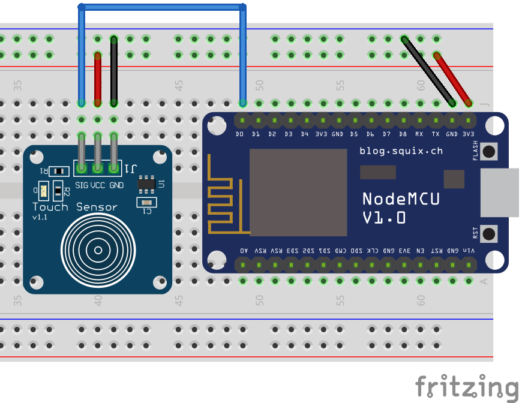

# Capacitive Touch Button (TTP223)

The TTP223 is a capacitive touch button, which means it does not have moving parts like a normal button. You can activate it by simply touching 🖐️ the sensing area regardless of the applied pressure. In fact, you can also extend its sensing area by connecting a conductive material (*i.e.*, conductive tape) to the metal circle in the back of the button. However, keep in mind that for this to work it should be done with the sensor powered off.



The code below reads the output from the sensor and prints a message on the Serial Monitor when the button is being pressed. The code itself is very simple and does not need any library for it to work.

```arduino
const int button_pin = D0;

void setup()
{
    Serial.begin(115200);
    pinMode(button_pin, INPUT);
}

void loop()
{
    if (digitalRead(button_pin) == HIGH)
    {
        Serial.println("Button is being pressed!");
    }
}
```

## A More Useful Code Example

The code above can be useful to understand the sensor, but you will find that for every second touching the sensor it will print hundreds of messages on the Serial Monitor. This is not suitable, for instance, if we want to send an MQTT message every time the button is pressed or released. For that, the following code is more appropriate.

?> **📚 Library:** for the following code to work you will need to install the [Bounce2 library by Thomas O Fredericks](https://github.com/thomasfredericks/Bounce2). To install it, go to `Deviot > Find/Install Library` and search for `Bounce2`, it should be the first result.

```arduino
#include <Bounce2.h>

const int button_pin = D0;
Bounce button_debouncer = Bounce(); 

void setup()
{
    Serial.begin(115200);
    pinMode(button_pin, INPUT);
    button_debouncer.attach(button_pin);
    button_debouncer.interval(5);
}

void loop()
{
    button_debouncer.update();
    if (button_debouncer.rose() == true)
    {
        Serial.println("Button pressed!");
    }
    if (button_debouncer.fell() == true)
    {
        Serial.println("Button released!");
    }
}
```