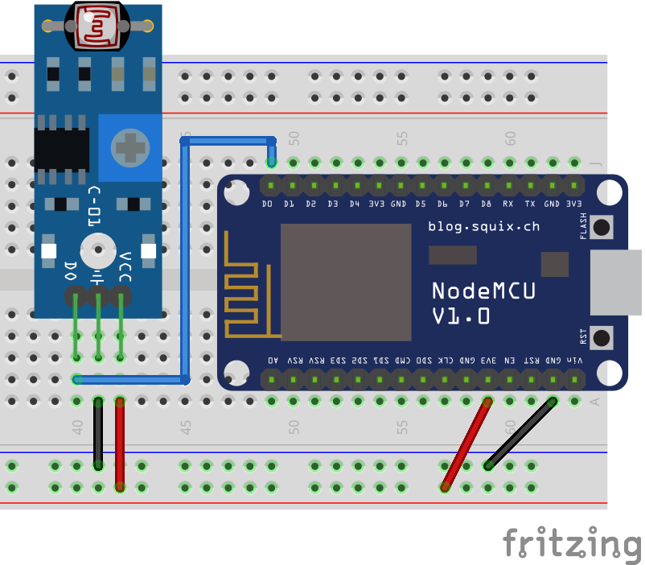

# Digital Luminosity Sensor (LDR)

This digital luminosity sensor indicate whether the detected luminosity is above or below a certain threshold, that can be adjusted. Because the signal is digital, it will not provide precise data such as a standalone LDR in an analog pin. But the digital signal makes this sensor easier to use in comparison with a standalone LDR. This sensor can be used to detect touchless interactions, such as reaching your hand towards the sensor without the need to actually touch it.



The following code reads the output from the sensor and prints a message on the Serial Monitor when the luminosity is below a certain threshold. The code itself is very simple and does not need any library for it to work.

?> **⚙️ Potentiometer:** if your sensor is never (or always) below the luminosity threshold, try gently turning the sensor's potentiometer. You can decrease the detection threshold by turning the potentiometer counter-clockwise or increase by turning it clockwise. Remember to turn it gently, as both extremes are usually not very useful.

```arduino
const int luminosity_pin = D0;

void setup()
{
    Serial.begin(115200);
    pinMode(luminosity_pin, INPUT);
}

void loop()
{
    if (digitalRead(luminosity_pin) == LOW)
    {
        Serial.println("Low luminosity detected!");
    }
}
```

## A More Useful Code Example

The code above can be useful to understand the sensor, but you will find that for every second the luminosity is low the sensor it will print hundreds of messages on the Serial Monitor. This is not suitable, for instance, if we want to send an MQTT message every time an obstacle is detected or stopped being detected. For that, the following code is more appropriate.

?> **📚 Library:** for the following code to work you will need to install the [Bounce2 library by Thomas O Fredericks](https://github.com/thomasfredericks/Bounce2). To install it, go to `Deviot > Find/Install Library` and search for `Bounce2`, it should be the first result.

```arduino
#include <Bounce2.h>

const int luminosity_pin = D0;
Bounce luminosity_debouncer = Bounce(); 

void setup()
{
    Serial.begin(115200);
    pinMode(luminosity_pin, INPUT);
    luminosity_debouncer.attach(luminosity_pin);
    luminosity_debouncer.interval(5);
}

void loop()
{
    luminosity_debouncer.update();
    if (luminosity_debouncer.rose() == true)
    {
        Serial.println("Low luminosity detected!");
    }
    if (luminosity_debouncer.fell() == true)
    {
        Serial.println("High luminosity detected!");
    }
}
```