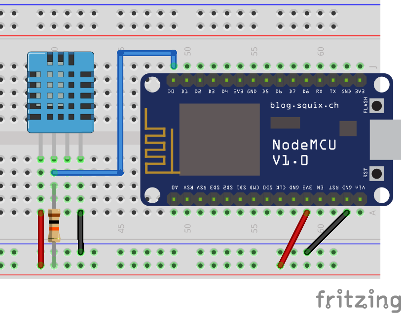

# Humidity and Temperature Sensor (DHT11)

The DHT11 is a basic digital temperature 🌡️ and humidity ☁️ sensor. It uses a capacitive humidity sensor and a thermistor to measure relative air humidity and temperature, respectively. It can be used to monitor the temperature and humidity of an ambient, but it can also detect some forms of human interaction (if you blow on it, you might see an increase in both temperature and humidity), but keep in mind that it can only be read once every second or two. For more information o DHT sensors, this tutorial is recommended: [DHTxx Sensors](https://learn.adafruit.com/dht/overview).



!>**⚡ Resistor:** for the safety of your components, don't forget to use a 10KΩ resistor as illustrated.

The code below performs temperature and relative humidity measurements every second and print the results on the Serial Monitor (for temperature, it prints the temperature in both Celcius and Fahrenheit). It is important to pay attention that to conduct the reading only every second, to use the `delay()` function would be the easiest solution. However, it comes at the cost of pausing the whole program for one second every loop ⏳. Because sometimes you need to do two things at once (like to read the temperature while also reading a button press), the following code makes use of some time related variables and conditions to avoid using the delay function.

?> **📚 Library:** for the following code to work you will need to install the [DHT library by Mark Ruys](https://github.com/markruys/arduino-DHT). To install it, go to `Deviot > Find/Install Library` and search for `DHT`, it should be the first result.

```arduino
#include <DHT.h>

DHT dht;

const int dht_pin = D0;

unsigned long dht_interval;
unsigned long dht_previousMillis = 0;

void setup()
{
    Serial.begin(115200);
    dht.setup(dht_pin);
    dht_interval = dht.getMinimumSamplingPeriod();
}

void loop()
{
    unsigned long dht_currentMillis = millis();
    if (dht_currentMillis - dht_previousMillis >= dht_interval)
    {
        dht_previousMillis = dht_currentMillis;

        float humidity = dht.getHumidity();
        float temperature_celsius = dht.getTemperature();
        float temperature_fahrenheit = dht.toFahrenheit(temperature_celsius);

        if (dht.getStatusString() == "OK")
        {
            Serial.print("Humidity: ");
            Serial.print(humidity);
            Serial.println("%");

            Serial.print("Temperature: ");
            Serial.print(temperature_celsius);
            Serial.print("°C / ");
            Serial.print(temperature_fahrenheit);
            Serial.println("°F");
        }
        else
        {
            Serial.print("Error: ");
            Serial.println(dht.getStatusString());
        }
    }
}
```