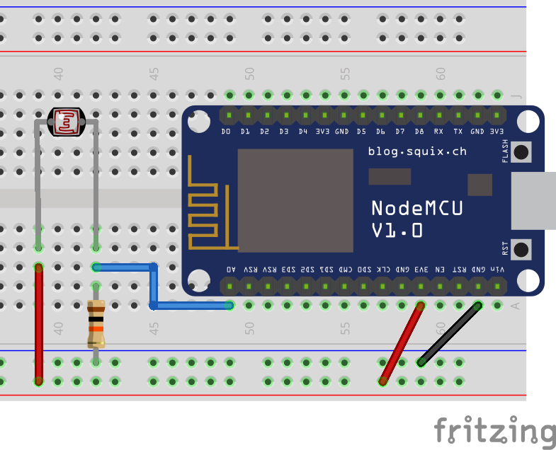

# Luminosity Sensor (LDR)

The LDR (Light Dependent Resistor) luminosity sensor is a very small and inexpensive analog sensor. It works by changing resistance depending on the amount of light 💡 that it is exposed to. It can be used to detect when a light is turned on or off, or even when you cover the sensor with your hand in a well-lit environment. In conjunction with the microcontroller, it is capable of detecting luminosity levels on a scale ranging from 0 to 1023.



!>**⚡ Resistor:** for the safety of your components, don't forget to use a 10KΩ resistor as illustrated.

The following code reads the luminosity value detected by the sensor and prints it on the Serial Monitor in real time. The code itself is very simple and does not need any library for it to work.

```arduino
const int luminosity_pin = A0;

void setup()
{
    Serial.begin(115200);
    pinMode(luminosity_pin, INPUT);
}

void loop()
{
    Serial.print("Luminosity (0-1023): ");
    Serial.println(analogRead(luminosity_pin));
}
```

## A More Useful Code Example

The code above can be useful to understand the sensor, but it will print hundreds of messages on the Serial Monitor every second. This is not suitable, for instance, if we only want to send an MQTT message when there is a meaningful change in luminosity. For that, the following code is more appropriate. The logic is that the current luminosity is only printed on the Serial Monitor if it is significantly different from the previous printed value (by default the difference is `> 300`, but you can tweak this value to better suit your needs).

```arduino
const int luminosity_pin = A0;
int last_luminosity = 0;

void setup()
{
    Serial.begin(115200);
    pinMode(luminosity_pin, INPUT);
}

void loop()
{
    int luminosity = analogRead(luminosity_pin);
    if (abs(luminosity - last_luminosity) > 300)
    {
        Serial.print("Luminosity (0-1023): ");
        Serial.println(luminosity);
        last_luminosity = luminosity;
    }
}
```