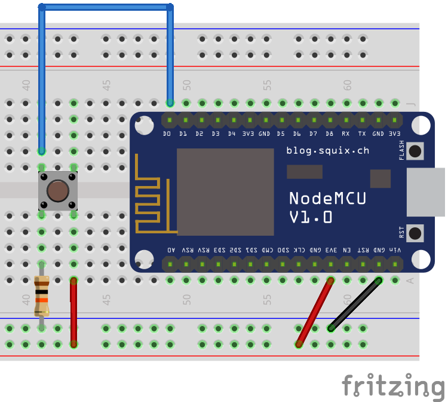

# Push Button

Push buttons are as simple as their name suggest: buttons that can be pressed. But don't understimate their simplicity yet. Besides being used as common buttons when needed, they can also be used beneath other surfaces to make them pressable, with the benefit of having a satisfying tactile feel and clicking sound feedback.



!>**⚡ Resistor:** for the safety of your components, don't forget to use a 10kΩ resistor as illustrated.

The code below reads the output from the push button and prints a message on the Serial Monitor when the button is being pressed. While the button is not pressed, the `D0` pin is connected to `GND` with a 10kΩ resistor, therefore it reads `LOW`. When the button is pressed, `D0` is also connected to `Vcc`, but with no resistance, therefore it reads `HIGH`. The code itself is straightforward and does not need any library for it to work.

```arduino
const int button_pin = D0;

void setup()
{
    Serial.begin(115200);
    pinMode(button_pin, INPUT);
}

void loop()
{
    if (digitalRead(button_pin) == HIGH)
    {
        Serial.println("The push button is being pressed!");
    }
}
```

## A More Useful Code Example

The code above can be useful to understand the push button, but you will find that for every second pressing the button it will print hundreds of messages on the Serial Monitor. This is not suitable, for instance, if we want to send an MQTT message every time the button is pressed or released. For that, the following code is more appropriate.

?> **📚 Library:** for the following code to work you will need to install the [Bounce2 library by Thomas O Fredericks](https://github.com/thomasfredericks/Bounce2). To install it, go to `Deviot > Find/Install Library` and search for `Bounce2`, it should be the first result.

```arduino
#include <Bounce2.h>

const int button_pin = D0;
Bounce button_debouncer = Bounce(); 

void setup()
{
    Serial.begin(115200);
    pinMode(button_pin, INPUT);
    button_debouncer.attach(button_pin);
    button_debouncer.interval(5);
}

void loop()
{
    button_debouncer.update();
    if (button_debouncer.rose() == true)
    {
        Serial.println("Button pressed!");
    }
    if (button_debouncer.fell() == true)
    {
        Serial.println("Button released!");
    }
}
```