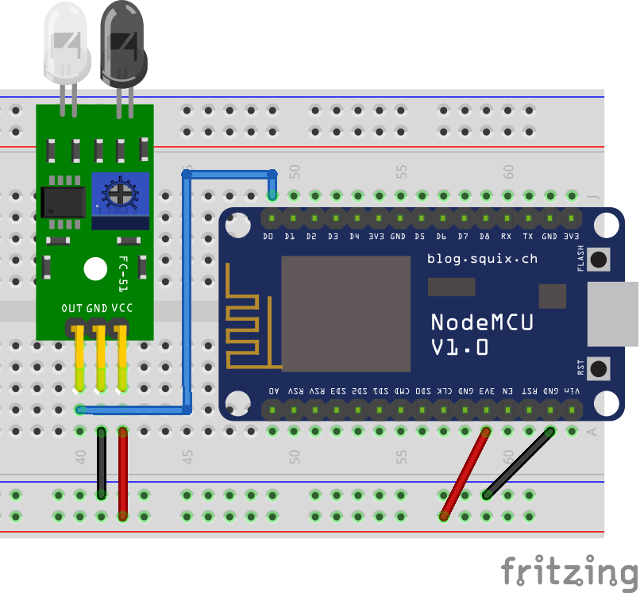

# Reflexive Obstacle Sensor (FC-51)

The FC-51 is a digital reflexive obstacle sensor. It is capable of detecting the presence of objects (or anything that reflects light, such as your hand) positioned from 2 to 30 centimeters from it. Keep in mind that the signal is binary, it will only inform the presence or absence of an object, not the distance. This sensor can be used to detect touchless interactions, such as reaching your hand towards the sensor without the need to actually touch it.



The following code reads the output from the sensor and prints a message on the Serial Monitor when an obstruction is detected in front of the sensor. The code itself is very simple and does not need any library for it to work.

?> **Potentiometer:** if your sensor never detects an obstacle, or detects obstacles when there are none, try gently turning the sensor's potentiometer. You can decrease the detection distance to about 2 centimeters by turning the potentiometer counter-clockwise or increase the distance for up to 30 centimeters by turning it clockwise. However, remember to turn it gently, as both extremes are usually not very useful.

```arduino
const int obstacle_pin = D0;

void setup()
{
    Serial.begin(115200);
    pinMode(obstacle_pin, INPUT);
}

void loop()
{
    if (digitalRead(obstacle_pin) == LOW)
    {
        Serial.println("Obstacle detected!");
    }
}
```

## A More Useful Code Example

The code above can be useful to understand the sensor, but you will find that for every second an obstacle is detected the sensor it will print hundreds of messages on the Serial Monitor. This is not suitable, for instance, if we want to send an MQTT message every time an obstacle is detected or stopped being detected. For that, the following code is more appropriate.

?> **Library:** for the following code to work you will need to install the [Bounce2 library by Thomas O Fredericks](https://github.com/thomasfredericks/Bounce2). To install it, go to `Deviot > Find/Install Library` and search for `Bounce2`, it should be the first result.

```arduino
#include <Bounce2.h>

const int obstacle_pin = D0;
Bounce obstacle_debouncer = Bounce(); 

void setup()
{
    Serial.begin(115200);
    pinMode(obstacle_pin, INPUT);
    obstacle_debouncer.attach(obstacle_pin);
    obstacle_debouncer.interval(5);
}

void loop()
{
    obstacle_debouncer.update();
    if (obstacle_debouncer.rose() == true)
    {
        Serial.println("Obstacle gone!");
    }
    if (obstacle_debouncer.fell() == true)
    {
        Serial.println("Obstacle detected!");
    }
}
```