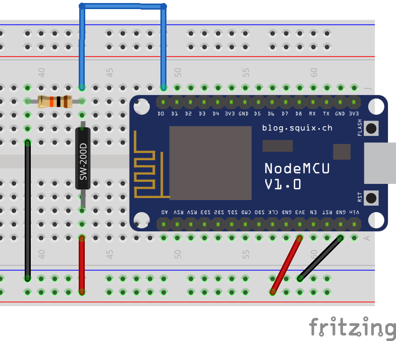

# Tilt Sensor (SW-200D)

The SW-200D tilt sensor is similar to a push button in the way it works. However, it is not activated by pressure, but by inclination. Depeding on the angle of the sensor, it may or may not allow current to pass, and the current state can be changed with a simple tilt of the sensor (or the object the sensor is embedded in).



!>**⚡ Resistor:** for the safety of your components, don't forget to use a 10kΩ resistor as illustrated.

The code below reads the output from the tilt sensor and prints a message on the Serial Monitor when the sensor is being allowing current to pass. While the sensor does not allow current to pass, the `D0` pin is connected to `GND` with a 10kΩ resistor, therefore it reads `LOW`. When the sensor allows current to pass, `D0` is also connected to `Vcc`, but with no resistance, therefore it reads `HIGH`. The code itself is straightforward and does not need any library for it to work.

```arduino
const int tilt_sensor_pin = D0;

void setup()
{
    Serial.begin(115200);
    pinMode(tilt_sensor_pin, INPUT);
}

void loop()
{
    if (digitalRead(tilt_sensor_pin) == HIGH)
    {
        Serial.println("The tilt sensor is tilted!");
    }
}
```

## A More Useful Code Example

The code above can be useful to understand the tilt sensor, but you will find that for every second tilting the sensor it will print hundreds of messages on the Serial Monitor. This is not suitable, for instance, if we want to send an MQTT message every time the sensor is tilted or untilted. For that, the following code is more appropriate.

?> **📚 Library:** for the following code to work you will need to install the [Bounce2 library by Thomas O Fredericks](https://github.com/thomasfredericks/Bounce2). To install it, go to `Deviot > Find/Install Library` and search for `Bounce2`, it should be the first result.

```arduino
#include <Bounce2.h>

const int tilt_sensor_pin = D0;
Bounce tilt_sensor_debouncer = Bounce(); 

void setup()
{
    Serial.begin(115200);
    pinMode(tilt_sensor_pin, INPUT);
    tilt_sensor_debouncer.attach(tilt_sensor_pin);
    tilt_sensor_debouncer.interval(5);
}

void loop()
{
    tilt_sensor_debouncer.update();
    if (tilt_sensor_debouncer.rose() == true)
    {
        Serial.println("Sensor tilted!");
    }
    if (tilt_sensor_debouncer.fell() == true)
    {
        Serial.println("Sensor untilted!");
    }
}
```