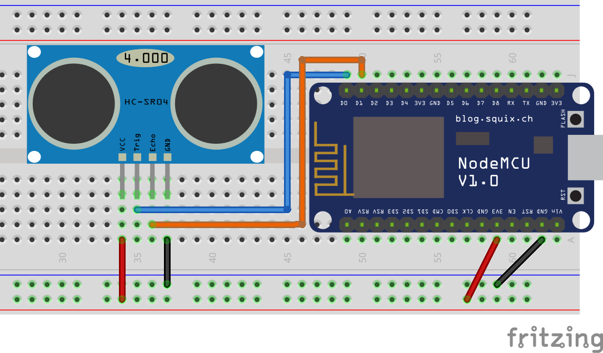

# Ultrasonic Distance Sensor (HC-SR04)

The ultrasonic distance sensor (HC-SR04) is a relatively simple and easy to use sensor that makes use of the speed of sound 🔊 to detect distance (I know, science is great!). In this regard, it is similar to the sonar system of a submarine, or the parking sensor in a car 🚗 that warns you when you get too close to the vehicle behind you.



The code below is a minimal example that displays the distance between any object in front of the sensor. One of the pins acts as a trigger, and the other waits for the response (echo), and the distance is calculated according to the duration between the trigger and the echo (sound travels at around 340 m/s, and it has to go to the object and come back).

?>**🤔 Weird reading?** If the sensor fails to detect anything, it will instead return its maximum possible value (it can vary between sensors, but it is usually between 3 and 4 meters). If needed, you can filter any result beyond a certain value (for instance, anything beyond 3000 cm) and return a custom message like `Out of range!`.

```arduino
const int trigger_pin = D0;
const int echo_pin = D1;

int distance;

void setup()
{
    Serial.begin(115200);
    pinMode(trigger_pin, OUTPUT);
    digitalWrite(trigger_pin, LOW);
    pinMode(echo_pin, INPUT);
}

void loop()
{    
    digitalWrite(trigger_pin, HIGH);
    delayMicroseconds(10);
    digitalWrite(trigger_pin, LOW);

    distance = pulseIn(echo_pin, HIGH) * 0.034 / 2;
    
    Serial.print("Distance (cm): ");
    Serial.println(distance);
}
```