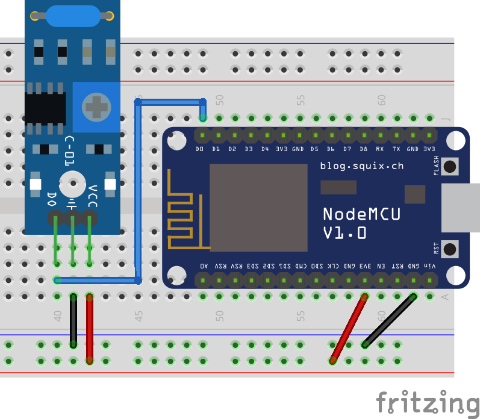

# Vibration Sensor (SW-420)

The SW-420 is a digital vibration sensor. After a certain vibration threshold (adjustable in the sensor's potentiometer) it will output a signal informing that there is a vibration. Keep in mind that the signal is binary, it will only notify the presence or absence of vibration, not intensity. This sensor can be handy as a low cost and easy to use motion sensor when compared to an accelerometer, which is both more expensive and complicated to use.



The following code reads the output from the sensor and prints a message on the Serial Monitor when vibration is detected. The code itself is straightforward and does not need any library for it to work.

?> **⚙️ Potentiometer:** if your sensor never detects a vibration, or detects too many, try gently turning the sensor's potentiometer. You can make it more sensible by turning the potentiometer counter-clockwise, or less sensitive by turning it clockwise. However, remember to turn it gently, as both extremes are usually not very useful.

```arduino
const int vibration_pin = D0;

void setup()
{
    Serial.begin(115200);
    pinMode(vibration_pin, INPUT);
}

void loop()
{
    if (digitalRead(vibration_pin) == HIGH)
    {
        Serial.println("Vibration detected!");
    }
}
```

## A More Useful Code Example

The code above can be useful to understand the sensor, but you will find that for every small nudge to the sensor it will print hundreds of messages on the Serial Monitor. This is not suitable, for instance, if we want to send an MQTT message every time a vibration is detected or has stopped. For that, the following code is more appropriate. The logic is that, without using the blocking `delay()` function, every time a vibration is detected the code enters a “vibrating” state that will expire after 500 milliseconds, but only if no further vibrations are detected in that timeframe.

```arduino
const int vibration_pin = D0;

boolean vibrating = false;
unsigned long vibration_previousMillis = 0;
const int vibration_interval = 500;

void setup()
{
    Serial.begin(115200);
    pinMode(vibration_pin, INPUT);
}

void loop()
{
    unsigned long vibration_currentMillis = millis();
    if (digitalRead(vibration_pin) == HIGH)
    {
        vibration_previousMillis = vibration_currentMillis;
        if (vibrating == false)
        {
            vibrating = true;
            Serial.println("Vibration detected!");
        }
    }
    else if (digitalRead(vibration_pin) == LOW)
    {
        if(vibrating == true)
        {
            if (vibration_currentMillis - vibration_previousMillis >= vibration_interval)
            {
                vibrating = false;
                Serial.println("Vibration stopped!");
            }
        }
    }
}
```